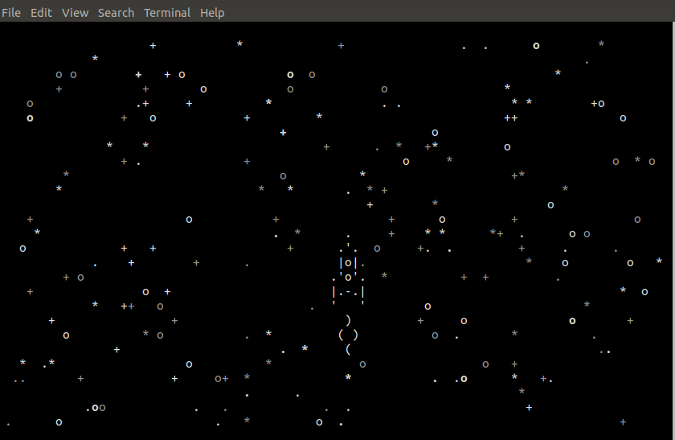

# Async console game

The script shows in terminal a spaceship on a space background with blinking stars.
 User has spaceship control with arrow keys.

 Game uses <a href="https://docs.python.org/3/library/curses.html">curses</a>
  module with asynchronous way, based on <a href="https://docs.python.org/3/library/asyncio.html">asyncio</a> library.


### How to install

Python3 should be already installed.


### Quickstart

Run **main.py**, for example:

```bash
$ python main.py

```




### Project Goals

The code is written for educational purposes on online-course for web-developers [dvmn.org](https://dvmn.org/).
